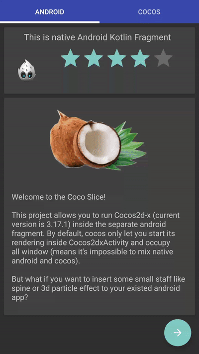

# CocoSlice
This project allows you to run Cocos2d-x (current version is 3.17.1) inside the separate android fragment.

[buy me a cup of coffee](http://ko-fi.com/intmainreturn00) ☕️

Implementation details [Medium Post](https://medium.com/@intmainreturn00/cocos2dx-sliced-3f2434226b87) 
